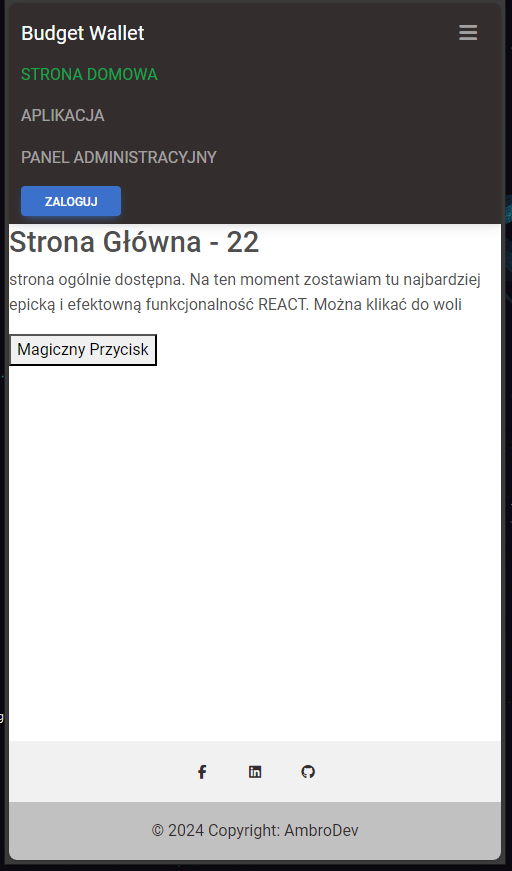
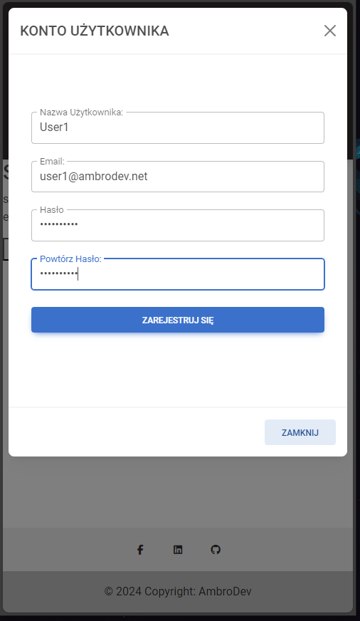
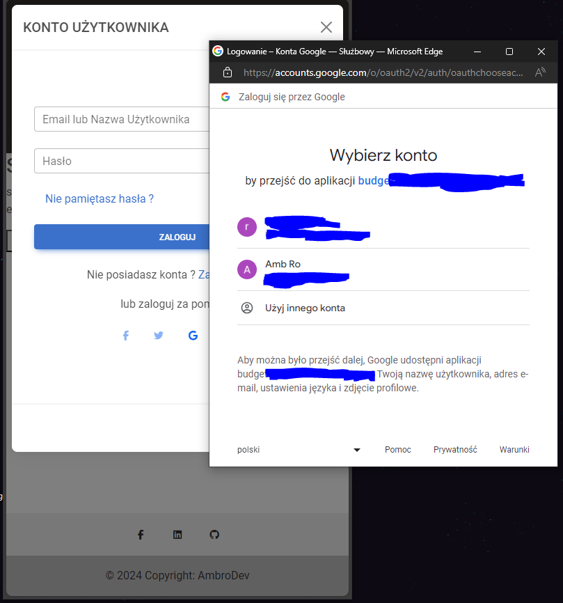
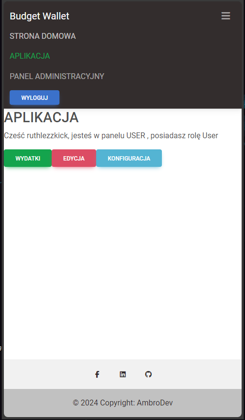
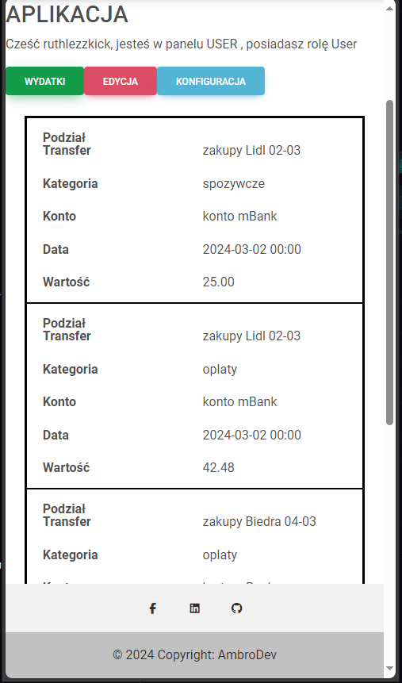
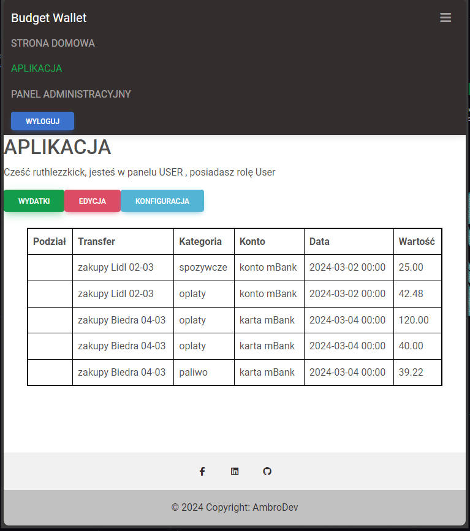

# GitHubSandBox
Project for testing Git

### Image Test

{: width="auto" height="300px"}
 {: width="auto" height="300px"}
 {: width="auto" height="300px"}

{: width="auto" height="300px"}
 {: width="auto" height="300px"}
 {: width="auto" height="300px"}

{: width="auto" height="300px"}

